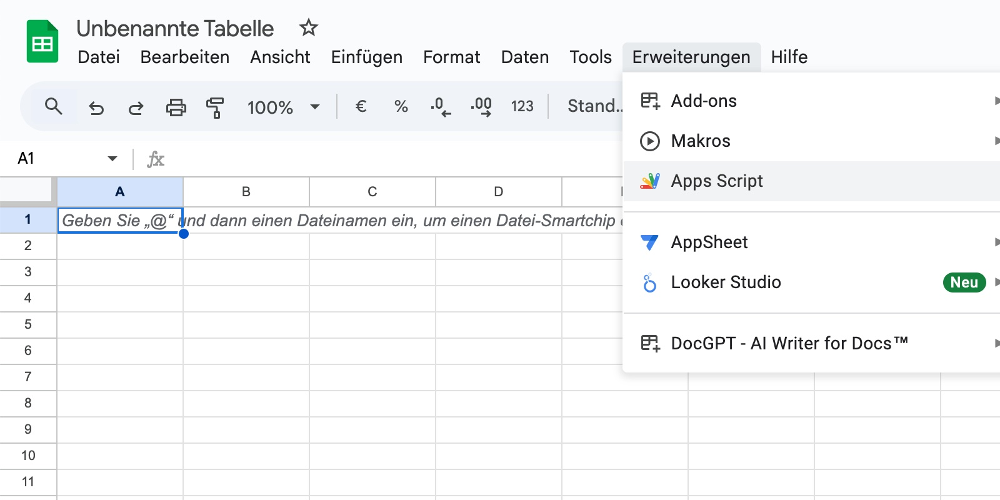
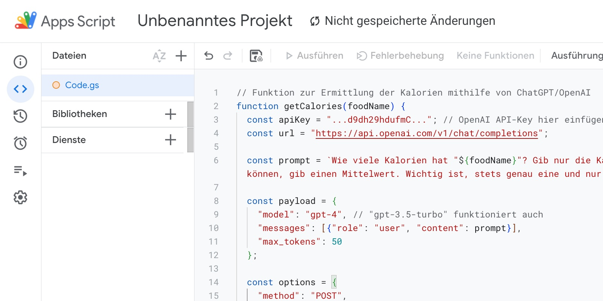
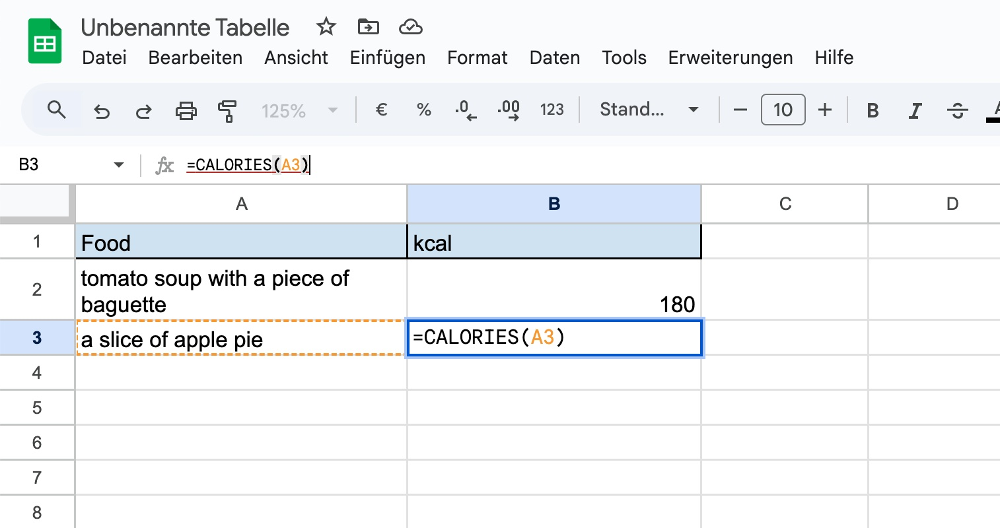

# CALORIES() for Google Sheets

Are you also annoyed by having to laboriously calculate the calorie value of a snack or meal? This is a script for Google Sheets that calculates a suitable kcal number for the description of a dish or meal. It implements a new function CALORIES() that takes a written description of a meal as input and returns the estimated kcal value by asking OpenAI's ChatGPT for it. Since ChatGPT accepts multilingual input, so does this script.

Translated with DeepL.com (free version)
```=CALORIES("One Croissant and a Café au lait.")``` returns ```310``` (or a similar value)

ChatGPT gives different results for the same prompt. I think on average it's a good estimate of what the actual energy of the food was.

## How To Use

1. Open Apps Script
 


2. Insert code and your OpenAI API key

Don't forget to press the Save-Button.



3. Use the new CALORIES function!



